# AWS VPC Explained in a Visual and Practical Way

*A detailed, beginner-friendly guide to Amazon VPC and related networking concepts in AWS.*

---

## Table of Contents

1. [What Is a VPC?](#1-what-is-a-vpc)
2. [Why Do We Need a VPC?](#2-why-do-we-need-a-vpc)
3. [The Best Mental Model for Understanding VPC](#3-the-best-mental-model-for-understanding-vpc)
4. [CIDR Blocks and IP Addressing](#4-cidr-blocks-and-ip-addressing)
5. [Subnets](#5-subnets)
6. [Route Tables](#6-route-tables)
7. [Internet Gateway](#7-internet-gateway)
8. [Public Subnet vs Private Subnet](#8-public-subnet-vs-private-subnet)
9. [NAT Gateway](#9-nat-gateway)
10. [Security Groups](#10-security-groups)
11. [Network ACLs](#11-network-acls)
12. [Availability Zones and High Availability](#12-availability-zones-and-high-availability)
13. [A Common Real-World AWS Architecture](#13-a-common-real-world-aws-architecture)
14. [VPC Endpoints](#14-vpc-endpoints)
15. [VPC Peering, Transit Gateway, and VPC Lattice](#15-vpc-peering-transit-gateway-and-vpc-lattice)
16. [VPC Flow Logs](#16-vpc-flow-logs)
17. [Common Mistakes and Misunderstandings](#17-common-mistakes-and-misunderstandings)
18. [How to Think When Designing a VPC](#18-how-to-think-when-designing-a-vpc)
19. [A Simple Deployment Example](#19-a-simple-deployment-example)
20. [Quick Summary](#20-quick-summary)
21. [References](#21-references)

---

## 1. What Is a VPC?

An **Amazon VPC (Virtual Private Cloud)** is a **logically isolated virtual network** that you create inside AWS. It lets you define your own IP address range, create subnets, configure route tables, attach gateways, and control traffic with multiple security layers. AWS describes Amazon VPC as a virtual network that closely resembles a traditional network you would operate in your own data center, but running on AWS infrastructure.[^1][^2]

### Simple definition

If AWS is a giant city, then a **VPC is your private neighborhood inside that city**.

Inside that neighborhood, you decide:

- how large the network is
- how to split it into smaller areas
- which resources are public
- which resources are internal only
- how traffic enters, exits, and moves inside
- which security rules apply

---

## 2. Why Do We Need a VPC?

Without a VPC, all infrastructure would feel like it was floating in the cloud with no clear network design. In real systems, you need to answer questions like:

- Which servers must be reachable from the internet?
- Which servers should never be public?
- Where should the database live?
- How does a private server download updates?
- How do services communicate securely?

A VPC gives you that structure. It is the **foundation of networking** for many AWS services such as EC2, RDS, ALB/NLB, EKS worker nodes, and Lambda functions configured for VPC access.[^1][^3]

---

## 3. The Best Mental Model for Understanding VPC

Use this picture in your head:

- **AWS Region** = a large city
- **VPC** = your private neighborhood
- **Subnet** = a smaller district inside your neighborhood
- **Route Table** = road signs and traffic directions
- **Internet Gateway** = the main gate to the public internet
- **NAT Gateway** = a controlled exit for internal servers
- **Security Group** = security guard at each building
- **Network ACL** = checkpoint at the entrance of each district
- **EC2 / RDS / ALB** = buildings and infrastructure inside the neighborhood

### Visual overview

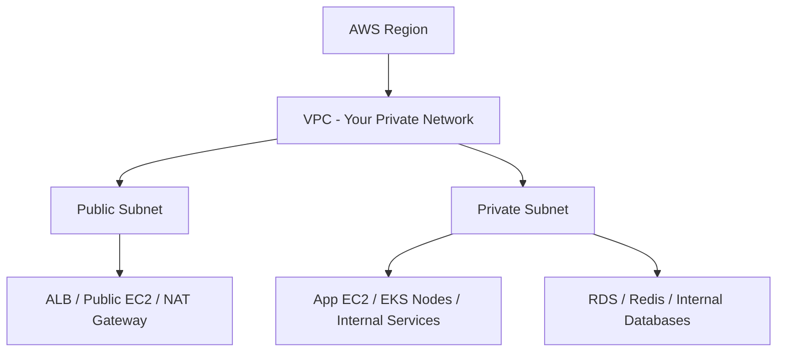

This is why VPC is not just a theory topic. It is the **networking map** behind nearly every real AWS deployment.

---

## 4. CIDR Blocks and IP Addressing

When you create a VPC, you choose a **CIDR block**, which defines the private IP address range available inside that VPC.[^4]

Example:

```txt
10.0.0.0/16
```

This means your VPC can use addresses in the `10.0.x.x` range.

### Example layout

- VPC: `10.0.0.0/16`
- Public Subnet A: `10.0.1.0/24`
- Public Subnet B: `10.0.2.0/24`
- Private App Subnet A: `10.0.11.0/24`
- Private App Subnet B: `10.0.12.0/24`
- Private DB Subnet A: `10.0.21.0/24`
- Private DB Subnet B: `10.0.22.0/24`

### Easy way to think about CIDR

- **VPC CIDR** = all the land you own
- **Subnet CIDR** = smaller plots of land split from that bigger area

### Why does this matter?

Because every EC2 instance, database, load balancer interface, and internal service endpoint in the VPC uses IP addresses from these ranges.

---

## 5. Subnets

A **subnet** is a smaller network range inside a VPC. Each subnet exists in **one Availability Zone (AZ)**.[^5]

### Example

- `10.0.1.0/24` in `ap-southeast-1a`
- `10.0.2.0/24` in `ap-southeast-1b`

These are two different subnets in two different AZs.

### Important truth

A subnet is **not inherently public or private by itself**.

Whether a subnet behaves like a public or private subnet depends mainly on:

- its **route table**
- whether resources have **public IPs**
- whether gateways are attached and reachable

This is one of the most important VPC concepts to understand correctly.[^6][^7]

---

## 6. Route Tables

A **route table** tells traffic where to go. Every subnet must be associated with a route table.[^6]

### Example: public subnet route table

```txt
Destination      Target
10.0.0.0/16      local
0.0.0.0/0        igw-123456
```

Meaning:

- traffic within the VPC goes to `local`
- traffic to the internet goes to the **Internet Gateway**

### Example: private subnet route table

```txt
Destination      Target
10.0.0.0/16      local
0.0.0.0/0        nat-123456
```

Meaning:

- traffic inside the VPC stays internal
- outbound internet traffic goes through a **NAT Gateway**

### Visual explanation

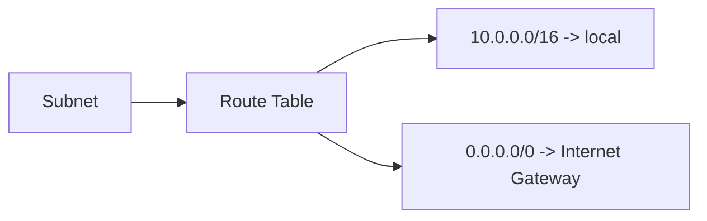

Or for private subnets:

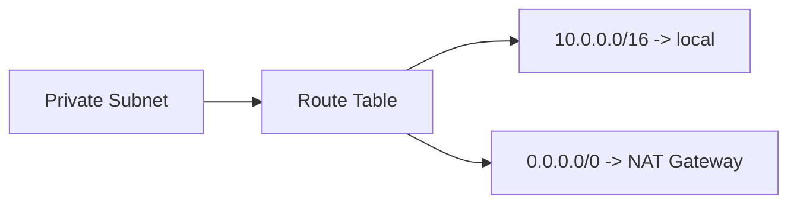

Think of a route table as the **traffic map** for a subnet.

---

## 7. Internet Gateway

An **Internet Gateway (IGW)** is attached to a VPC to allow communication with the public internet. AWS documents it as the VPC-side component that enables internet-routable traffic.[^7]

### What the IGW does

It acts like the **front gate** of your VPC.

But having an IGW alone does **not** automatically make everything public.

For an instance to be directly internet-accessible, several things typically need to line up:

1. the VPC has an attached Internet Gateway
2. the subnet route table points `0.0.0.0/0` to that IGW
3. the instance has a public IPv4 address or Elastic IP if using IPv4 public access
4. the Security Group / NACL allow the traffic

### Visual

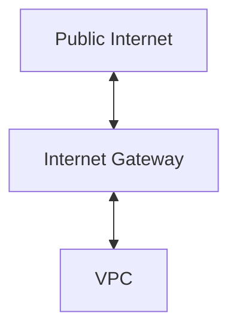

---

## 8. Public Subnet vs Private Subnet

### Public subnet

A subnet is generally considered **public** when it has a route to an Internet Gateway, and resources inside it can use public IP connectivity as needed.[^7]

Typical public resources:

- Application Load Balancer
- bastion host
- public EC2 web server
- NAT Gateway

### Private subnet

A subnet is considered **private** when it does **not** have a direct route to the Internet Gateway.[^8]

Typical private resources:

- app servers behind a load balancer
- internal APIs
- background workers
- databases such as RDS
- Redis / ElastiCache

### Side-by-side comparison

| Topic | Public Subnet | Private Subnet |
|---|---|---|
| Route to IGW | Yes | No direct route |
| Public inbound traffic | Possible | Not directly |
| Common resources | ALB, bastion, NAT | App EC2, RDS, workers |
| Public IP commonly used | Yes | Usually no |
| Safer for databases | No | Yes |

### Visual

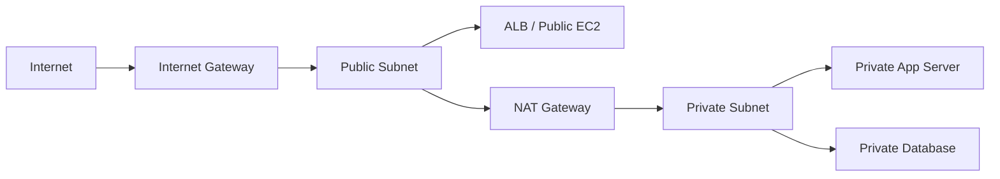

---

## 9. NAT Gateway

A **NAT Gateway** allows instances in a private subnet to initiate outbound connections to the internet or other AWS services, while preventing unsolicited inbound connections from the internet.[^9]

### Why do we need it?

Suppose your application server is private, but it still needs to:

- install packages
- download updates
- call third-party APIs
- reach public endpoints on the internet

You want outbound access, but you do **not** want the server exposed to the public internet.

That is exactly the job of a NAT Gateway.

### Typical path

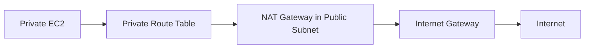

### Key AWS detail

A **public NAT Gateway** is created in a **public subnet** and uses an **Elastic IP** for internet connectivity.[^9]

### Core idea

- **private server can go out**
- **internet cannot start a connection back in**

This is one of the most important patterns in AWS networking.

---

## 10. Security Groups

A **Security Group (SG)** is a virtual firewall attached to a resource's network interface. AWS describes security groups as virtual firewalls that control inbound and outbound traffic for resources.[^10]

### Most important properties

- resource-level control
- **stateful**
- if inbound is allowed, return traffic is automatically allowed

### Example

#### Security Group for ALB
- inbound: `80`, `443` from `0.0.0.0/0`
- outbound: to app servers

#### Security Group for app server
- inbound: `8080` from ALB Security Group
- outbound: to database, internet via NAT, or other services

#### Security Group for RDS
- inbound: `3306` from app server Security Group only
- no open access from the internet

### Good practice

Avoid this whenever possible:

```txt
3306 from 0.0.0.0/0
```

Prefer this:

```txt
3306 from sg-app-server
```

That means the database trusts only the application tier, not the whole internet.

### Visual

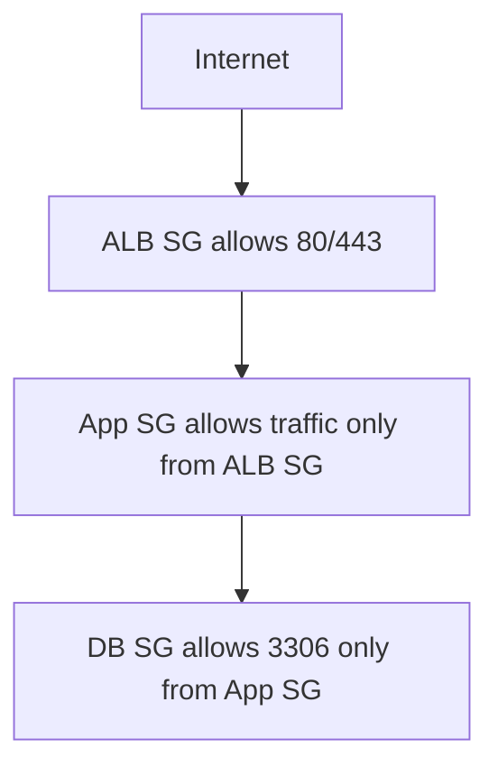

---

## 11. Network ACLs

A **Network ACL (NACL)** is a subnet-level firewall. AWS states that network ACLs control inbound and outbound traffic at the subnet boundary.[^11]

### Key differences from Security Groups

| Topic | Security Group | NACL |
|---|---|---|
| Scope | Resource / ENI | Subnet |
| Stateful | Yes | No |
| Return traffic | Automatically allowed | Must be explicitly allowed |
| Rule type | Allow only | Allow and deny |
| Typical daily use | Very common | Less common, more specialized |

### Easy mental model

- **Security Group** = guard at the building door
- **NACL** = checkpoint at the entrance of the district

### Practical advice

For most small and medium architectures, learn **Security Groups first**. Use NACLs as an extra subnet-level control layer when you really need that behavior.[^12]

---

## 12. Availability Zones and High Availability

A subnet belongs to **one Availability Zone only**. If you want high availability, you usually create multiple subnets across multiple AZs.[^5]

### Example layout across AZs

- Public Subnet A in `ap-southeast-1a`
- Public Subnet B in `ap-southeast-1b`
- Private App Subnet A in `ap-southeast-1a`
- Private App Subnet B in `ap-southeast-1b`
- Private DB Subnet A in `ap-southeast-1a`
- Private DB Subnet B in `ap-southeast-1b`

### Why this matters

If one AZ has an issue:

- the ALB can still work from another AZ
- app servers can still run in another AZ
- databases can be configured for higher availability depending on service design

### Visual

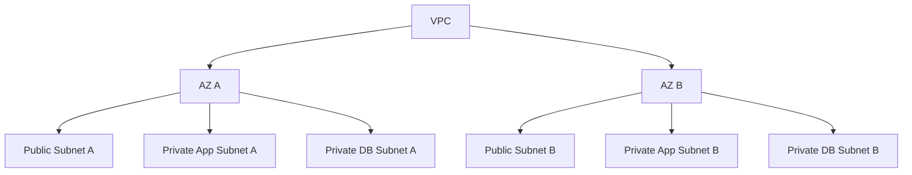

---

## 13. A Common Real-World AWS Architecture

This is one of the most common production-style VPC patterns.

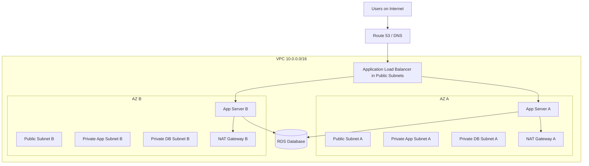

### How traffic flows

1. Users send requests from the internet.
2. DNS points the domain to the ALB.
3. The ALB lives in public subnets.
4. The ALB forwards traffic to app servers in private subnets.
5. App servers connect to the database in private DB subnets.
6. App servers use NAT Gateway when they need outbound internet access.

### Why this is good

- only the load balancer is public
- app servers are not directly exposed
- the database is isolated even further
- the design supports multiple AZs for better availability

AWS documents this type of architecture as a standard VPC pattern using public and private subnets with NAT gateways.[^8]

---

## 14. VPC Endpoints

A **VPC Endpoint** allows private connectivity from your VPC to supported AWS services without needing an Internet Gateway, NAT device, VPN, or Direct Connect for that traffic path.[^1][^13]

### Why is this useful?

Suppose a private EC2 instance needs to access S3.

A beginner might think:

- “Private subnet needs NAT to reach S3.”

But in many cases, you can instead use a **VPC Endpoint**, which keeps that traffic on AWS's private network.

### Benefits

- more private than going out to the public internet
- often reduces dependence on NAT for supported services
- can improve security posture

### Common examples

- S3 Gateway Endpoint
- interface endpoints for services like Systems Manager and others, depending on service support

### Visual

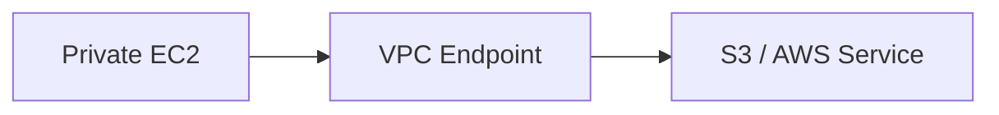

---

## 15. VPC Peering, Transit Gateway, and VPC Lattice

When systems grow, one VPC is often not enough.

### 15.1 VPC Peering

**VPC Peering** connects two VPCs so resources can communicate using private IPs, provided routing and security rules are configured correctly.[^14]

#### Example
- VPC A = application
- VPC B = shared services

If the app in VPC A needs to talk to Redis or internal APIs in VPC B, VPC Peering may be used.

### 15.2 Transit Gateway

When you have many VPCs, peering each one individually becomes hard to manage. **Transit Gateway** provides a hub-and-spoke model for connecting multiple VPCs and networks more centrally.[^13]

### 15.3 VPC Lattice

**Amazon VPC Lattice** is focused more on application-layer service connectivity and routing across VPCs and accounts, especially for service-to-service communication at scale.[^13]

### Simple comparison

| Feature | Best Use Case |
|---|---|
| VPC Peering | Small number of VPC-to-VPC private connections |
| Transit Gateway | Many VPCs, centralized network connectivity |
| VPC Lattice | Application/service connectivity across VPCs and accounts |

---

## 16. VPC Flow Logs

**VPC Flow Logs** capture information about IP traffic going to and from network interfaces in your VPC.[^12]

### Why they matter

They are very useful for:

- investigating connectivity issues
- checking whether traffic is accepted or rejected
- understanding what source and destination are involved
- security analysis and auditing

### Example debugging situations

- EC2 cannot connect to RDS
- app times out when calling another service
- you suspect a Security Group or NACL problem
- you want to understand unusual network behavior

Think of Flow Logs as **network activity records**.

---

## 17. Common Mistakes and Misunderstandings

### Mistake 1: “A subnet is automatically public or private.”

Not exactly. The behavior depends mainly on its **routes** and whether resources have public connectivity configured.[^6][^7]

### Mistake 2: “If I attach an Internet Gateway, everything can reach the internet.”

No. You still need:

- the right route table
- public IPs where appropriate
- Security Group / NACL rules that allow the traffic[^7]

### Mistake 3: “Private subnet means no internet access at all.”

Not true. A private subnet can still have outbound internet access through **NAT Gateway**, or private access to AWS services through **VPC Endpoints**.[^9][^13]

### Mistake 4: “Security Groups are enough to understand VPC networking.”

Security Groups are only one layer. Real troubleshooting often involves checking:

- subnet association
- route tables
- Internet Gateway
- NAT Gateway
- public IP assignment
- Security Groups
- NACLs

---

## 18. How to Think When Designing a VPC

Do not start by asking:

> How many subnets should I create?

Start with these questions instead:

### 1. Which resources must be public?
Examples:
- ALB
- bastion host
- NAT Gateway

### 2. Which resources must stay private?
Examples:
- application servers
- internal services
- worker nodes
- databases
- Redis

### 3. Do I need multi-AZ availability?
In production, the answer is often yes.

### 4. Do private resources need outbound access?
If yes:
- NAT Gateway
- or VPC Endpoints for supported AWS services

### 5. Which components should be allowed to talk to each other?
That decision is implemented through:
- route tables
- Security Groups
- NACLs if needed

This mindset helps you design from **traffic flow and security** rather than from random configuration choices.

---

## 19. A Simple Deployment Example

Let us take a practical example:

### System
- frontend users on the internet
- Spring Boot application
- MySQL on Amazon RDS

### VPC design
- VPC: `10.0.0.0/16`
- Public Subnet A/B: ALB and NAT Gateway
- Private App Subnet A/B: EC2 application servers
- Private DB Subnet A/B: RDS MySQL

### Traffic flow

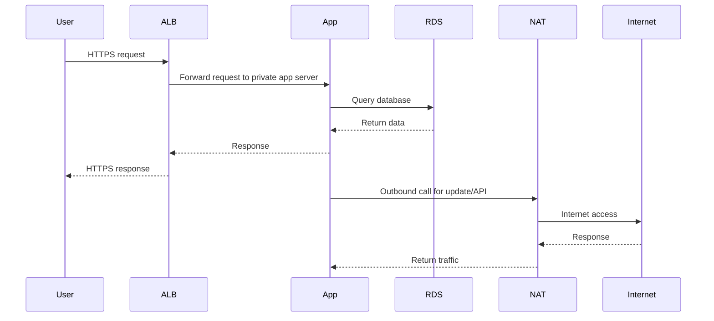

### Why this design is strong

- the public internet only reaches the load balancer
- app servers stay private
- the database stays private
- outbound internet access for private resources is controlled
- the architecture can scale across multiple AZs

---

## 20. Quick Summary

### The shortest possible explanation

- **VPC** = your private network in AWS
- **CIDR** = your IP address space
- **Subnet** = smaller network segment inside the VPC
- **Route Table** = traffic directions
- **Internet Gateway** = direct public internet gate
- **NAT Gateway** = controlled outbound internet access for private resources
- **Security Group** = stateful firewall at resource level
- **NACL** = stateless firewall at subnet level
- **VPC Endpoint** = private access to AWS services
- **VPC Peering / Transit Gateway / Lattice** = ways to connect VPCs or services
- **Flow Logs** = traffic records for analysis

### The one-sentence core idea

A VPC is the private network you design in AWS, and all the related concepts—subnets, routes, gateways, and firewalls—exist to decide **where resources live, how traffic moves, and who is allowed to access what**.

---

## 21. References

[^1]: AWS, *What is Amazon VPC?* https://docs.aws.amazon.com/vpc/latest/userguide/what-is-amazon-vpc.html
[^2]: AWS, *Amazon VPC Overview* https://aws.amazon.com/vpc/
[^3]: AWS, *How Amazon VPC Works* https://docs.aws.amazon.com/vpc/latest/userguide/how-it-works.html
[^4]: AWS, *IP addressing for your VPCs and subnets* https://docs.aws.amazon.com/vpc/latest/userguide/vpc-ip-addressing.html
[^5]: AWS, *Subnets for your VPC* https://docs.aws.amazon.com/vpc/latest/userguide/configure-subnets.html
[^6]: AWS, *Route tables* https://docs.aws.amazon.com/vpc/latest/userguide/VPC_Route_Tables.html
[^7]: AWS, *Internet gateways* https://docs.aws.amazon.com/vpc/latest/userguide/VPC_Internet_Gateway.html
[^8]: AWS, *VPC with public and private subnets (NAT)* https://docs.aws.amazon.com/vpc/latest/userguide/vpc-example-private-subnets-nat.html
[^9]: AWS, *NAT gateways* https://docs.aws.amazon.com/vpc/latest/userguide/vpc-nat-gateway.html
[^10]: AWS, *Control traffic to resources using security groups* https://docs.aws.amazon.com/vpc/latest/userguide/vpc-security-groups.html
[^11]: AWS, *Control subnet traffic with network access control lists* https://docs.aws.amazon.com/vpc/latest/userguide/vpc-network-acls.html
[^12]: AWS, *VPC security best practices* https://docs.aws.amazon.com/vpc/latest/userguide/vpc-security-best-practices.html
[^13]: AWS, *Amazon VPC documentation overview* https://aws.amazon.com/documentation-overview/vpc/
[^14]: AWS, *What is VPC peering?* https://docs.aws.amazon.com/vpc/latest/peering/what-is-vpc-peering.html

