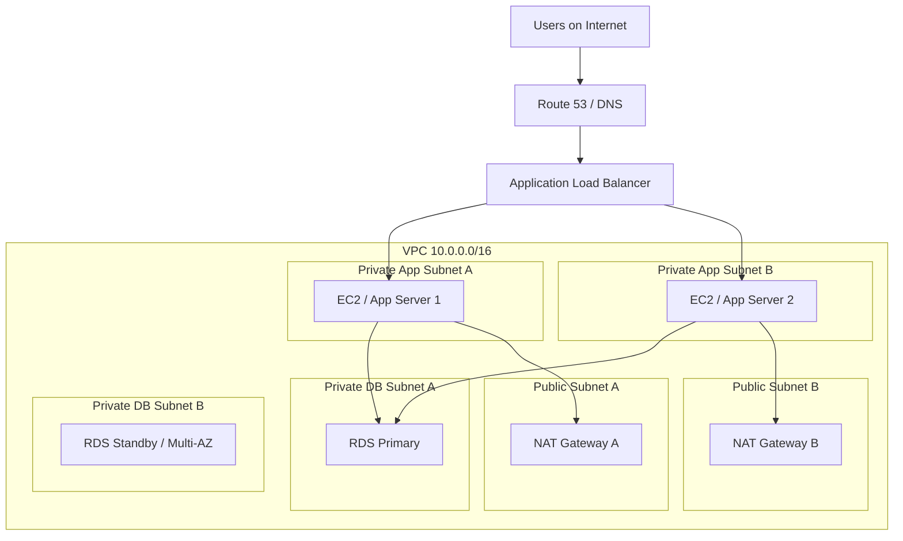
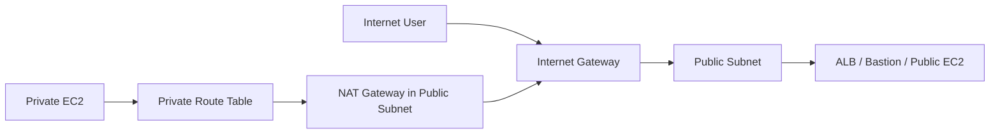

# AWS VPC: A Detailed and Visual Guide

## 1. What is a VPC?

**VPC (Virtual Private Cloud)** is a logically isolated virtual network that you create inside AWS. You can think of it as your own private networking space in the cloud, where you control IP ranges, subnets, routing, internet access, and security boundaries.

A simple analogy:

- **AWS Region** = a big city
- **Your VPC** = your private district in that city
- **Subnets** = smaller neighborhoods inside your district
- **Route Tables** = road maps
- **Internet Gateway** = the main gate to the public internet
- **NAT Gateway** = an outbound-only gate for private resources
- **Security Groups** = guards at each building
- **Network ACLs** = guards at the neighborhood entrance

---

## 2. Why VPC matters

Without VPC, all cloud resources would feel flat and exposed. VPC gives you the ability to:

- isolate environments
- separate public and private resources
- control traffic flow
- protect databases and internal services
- build production-ready multi-tier architectures

Typical resources that live in a VPC:

- EC2
- RDS
- ALB / NLB
- EKS worker nodes
- Lambda functions with VPC access

---

## 3. Core idea: think in layers

When learning VPC, think in this order:

1. **Address space** → CIDR blocks
2. **Segmentation** → Subnets
3. **Traffic direction** → Route tables
4. **Internet connectivity** → Internet Gateway / NAT Gateway
5. **Protection** → Security Groups / Network ACLs
6. **Advanced connectivity** → VPC Endpoints / Peering / Transit Gateway

---

## 4. CIDR block: the address space of your VPC

When you create a VPC, you assign it an IP range, for example:

```text
10.0.0.0/16
```

This means your VPC owns a large private address space.

Example split:

```text
VPC:              10.0.0.0/16
Public Subnet A:  10.0.1.0/24
Public Subnet B:  10.0.2.0/24
Private App A:    10.0.11.0/24
Private App B:    10.0.12.0/24
Private DB A:     10.0.21.0/24
Private DB B:     10.0.22.0/24
```

### Easy way to understand `/16` and `/24`

- `/16` = a large block of addresses
- `/24` = a smaller block carved out from the larger block

So:
- **VPC CIDR** = the total land you own
- **Subnet CIDR** = smaller plots inside that land

---

## 5. Subnets: splitting the VPC into smaller zones

A **subnet** is a portion of the VPC IP range.

Important rule:
- **One subnet belongs to one Availability Zone (AZ)**

Example:

- `10.0.1.0/24` in `ap-southeast-1a`
- `10.0.2.0/24` in `ap-southeast-1b`

This is important for high availability.

### Public vs private subnet

A subnet is not magically public or private by name.

It becomes:
- **Public** if its route table sends internet traffic to an **Internet Gateway**
- **Private** if it does not have a direct route to the Internet Gateway

---

## 6. Route tables: the traffic map

A **route table** tells traffic where to go.

Example for a public subnet:

```text
Destination      Target
10.0.0.0/16      local
0.0.0.0/0        igw-1234
```

Meaning:
- traffic inside the VPC stays local
- internet-bound traffic goes to the Internet Gateway

Example for a private subnet:

```text
Destination      Target
10.0.0.0/16      local
0.0.0.0/0        nat-1234
```

Meaning:
- internal traffic stays inside the VPC
- internet-bound traffic goes through NAT Gateway

---

## 7. Internet Gateway (IGW)

An **Internet Gateway** is the component that allows your VPC to communicate with the public internet.

But having an IGW alone is not enough.

For an EC2 instance to be truly internet-accessible, it usually needs:

- a subnet route to the IGW
- a public IP or Elastic IP
- a security group that allows the traffic

### Simple idea

- No IGW → no public internet access
- IGW exists but no route → still no internet access
- IGW + route + public IP → public access is possible

---

## 8. NAT Gateway

A **NAT Gateway** allows resources in a **private subnet** to access the internet **outbound only**, without allowing the internet to initiate inbound connections back to them.

This is perfect for:

- app servers that need to install packages
- internal services calling third-party APIs
- patching and updates from private subnets

### Traffic flow

```text
Private EC2 -> Private Route Table -> NAT Gateway -> Internet Gateway -> Internet
```

### Important placement rule

A NAT Gateway is usually placed in a **public subnet**.

---

## 9. Security Groups

A **Security Group** is a virtual firewall attached to resources like EC2 or ENIs.

### Key characteristics

- applied at resource level
- **stateful**
- most commonly used day-to-day

### Example

#### Web server security group

Inbound:
- allow `80` from anywhere
- allow `443` from anywhere

Outbound:
- allow outbound traffic as needed

#### Database security group

Inbound:
- allow `3306` only from the application server security group

Better than this:

```text
3306 from 0.0.0.0/0
```

Prefer this:

```text
3306 from app-server-sg
```

---

## 10. Network ACLs (NACLs)

A **Network ACL** is a subnet-level firewall.

### Key characteristics

- applied at subnet level
- **stateless**
- must explicitly allow return traffic if needed

### Easy analogy

- **Security Group** = security at each building
- **NACL** = checkpoint at the entrance to the neighborhood

In many systems, Security Groups do most of the practical work. NACLs are an additional control layer.

---

## 11. Public vs private subnet: the real difference

### Public subnet

Usually has:

- route `0.0.0.0/0 -> Internet Gateway`
- resources with public IP if direct internet communication is needed

### Private subnet

Usually has:

- no direct route to Internet Gateway
- may still reach the internet through NAT Gateway
- often used for app servers, databases, workers

---

## 12. Availability Zones and subnet design

Because a subnet belongs to one AZ, good production design usually spans multiple AZs.

Example:

- Public Subnet A in AZ-a
- Public Subnet B in AZ-b
- Private App A in AZ-a
- Private App B in AZ-b
- Private DB A in AZ-a
- Private DB B in AZ-b

This enables:

- ALB across multiple AZs
- EC2 app servers across multiple AZs
- Multi-AZ database setups

---

## 13. A common production architecture



### Why this design is strong

- only the load balancer is public-facing
- app servers stay private
- database stays private
- app servers can still reach the internet through NAT
- resources are spread across AZs for resilience

---

## 14. Visual comparison: public and private paths



### Reading the diagram

- public resources can receive inbound traffic from the internet
- private resources do not receive direct inbound internet traffic
- private resources can still go out through NAT Gateway

---

## 15. Why databases are usually private

Databases should generally not be exposed directly to the public internet.

Typical secure pattern:

- ALB in public subnet
- app servers in private subnet
- RDS in private subnet
- DB security group allows only the app security group

This reduces the attack surface dramatically.

---

## 16. VPC Endpoints

A **VPC Endpoint** lets private resources access certain AWS services without going through the public internet or NAT Gateway.

This is useful for:

- private access to S3
- private access to some AWS APIs
- reducing NAT traffic cost in some designs

### Simple intuition

Instead of:

```text
Private EC2 -> NAT Gateway -> Internet -> AWS Service
```

You can do:

```text
Private EC2 -> VPC Endpoint -> AWS Service
```

This is usually more private and sometimes more cost-efficient.

---

## 17. VPC Peering

**VPC Peering** connects two VPCs so resources in each VPC can talk to each other privately.

Example:

- VPC A = application
- VPC B = shared services

Possible use cases:

- app in VPC A calls internal service in VPC B
- app in VPC A accesses shared Redis or internal API in VPC B

To make it work, you usually need:

- a peering connection
- route table updates on both sides
- security group rules that allow the traffic

---

## 18. VPC Flow Logs

**VPC Flow Logs** help you observe network traffic at the VPC, subnet, or ENI level.

Useful when:

- EC2 cannot reach RDS
- a connection times out
- traffic is unexpectedly rejected
- you need networking audit visibility

Think of Flow Logs as the “network activity record” for troubleshooting.

---

## 19. Common misunderstandings

### Misunderstanding 1

**“A subnet becomes public just because I named it public.”**

False. It is the **route table** that matters.

### Misunderstanding 2

**“If I attach an Internet Gateway, all EC2 instances can use the internet.”**

False. You still need:
- route to IGW
- public IP if direct public communication is needed
- correct security group rules

### Misunderstanding 3

**“Private subnet means no outbound internet.”**

False. A private subnet can still go out through NAT Gateway.

### Misunderstanding 4

**“Security Groups are enough to understand all AWS networking.”**

Not quite. You must understand:
- route tables
- subnet association
- public IP
- IGW / NAT
- SG / NACL

---

## 20. Real-world example: Spring Boot + RDS on AWS

Imagine this stack:

- Route 53
- ALB
- 2 EC2 instances running Spring Boot
- RDS MySQL

### Network layout

- VPC: `10.0.0.0/16`
- Public Subnet A/B: ALB and NAT Gateway
- Private App Subnet A/B: Spring Boot EC2 instances
- Private DB Subnet A/B: RDS MySQL

### Traffic flow

1. User sends request to the domain
2. DNS resolves to ALB
3. ALB forwards request to EC2 in private subnets
4. EC2 talks to RDS in private DB subnet
5. EC2 uses NAT for outbound internet if needed

This is a very common and practical architecture pattern.

---

## 21. A mental model you should keep

If you want one sentence to remember the whole concept:

> **A VPC is your private network in AWS, and subnets, route tables, gateways, security groups, and NACLs are the tools you use to control where resources live, how traffic moves, and who can talk to whom.**

---

## 22. Quick summary table

| Component | Easy Meaning | Main Job |
|---|---|---|
| VPC | Your private cloud network | Defines the network boundary |
| CIDR | IP address space | Defines the available address range |
| Subnet | Smaller zone inside VPC | Organizes resources by network segment |
| Route Table | Traffic map | Decides where packets go |
| Internet Gateway | Public internet door | Enables internet connectivity |
| NAT Gateway | Outbound-only internet door | Lets private resources go out |
| Security Group | Resource firewall | Controls traffic at instance/resource level |
| NACL | Subnet firewall | Controls traffic at subnet boundary |
| VPC Endpoint | Private path to AWS services | Avoids public internet/NAT for supported services |
| VPC Peering | Private bridge between VPCs | Connects two VPCs |
| Flow Logs | Traffic records | Helps troubleshoot networking |

---

## 23. Final learning path recommendation

If you are learning AWS networking, study in this order:

1. VPC basics
2. CIDR
3. Subnets
4. Route tables
5. Internet Gateway
6. Public vs private subnets
7. NAT Gateway
8. Security Groups
9. Network ACLs
10. VPC Endpoints
11. VPC Peering / Transit Gateway
12. Flow Logs and troubleshooting

---

## 24. Bonus: a simple memory trick

Use this phrase:

**“Address, split, route, connect, protect.”**

- **Address** → CIDR
- **Split** → Subnets
- **Route** → Route Tables
- **Connect** → IGW / NAT / Endpoints / Peering
- **Protect** → SG / NACL

That single sequence gives you the logic of VPC design.
